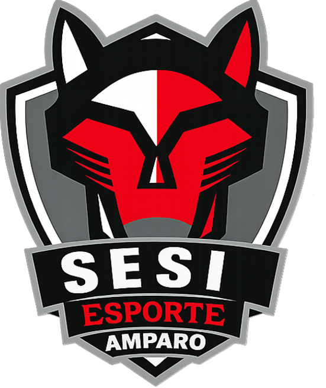

# SESI ESPORTE AMPARO

A partir de uma problemática clara: falta de incentivo de esporte na escola, foi realizado um projeto afim de criar um site sobre o esporte no Sesi Amparo 356. O tal site contém as mais recentes notícias e novidades, uniformes, calendário, elencos e campo de solicitação de treinos. 

## Problemática:

Partindo de uma pesquisa de campo, realizada com os alunos do 6° ano do fundamental 2 aos estudantes do 3° ano do ensino médio, consta que o nível de conhecimento e incentivo para o esporte na unidade 356 é extremamente baixo para os padrões SESI e para obter bons níveis de saúde.

## Como será feito:

Com um site simples e claro, sempre com atualizações recentes, mostrando as notícias envolvendo os resultados do Sesi Amparo e de alunos do mesmo, fotos dos elencose de todos os atletas, próximos eventos, uniformes utilizados e um campo de agendamento fácil e simples, o site visa extinguir a falta de incentivo e promover a saúde a partir da prática de esportes.

## Melhorias e vantagens:

Dentre todas as qualidades e promoções vindas a partir do site, são elas:
- Acesso à recursos esportivos;
- Centralização de conteúdo;
- Facilidade de Uso;
- Valorização dos atletas;
- Comunicação rápida (jogos, uniformes, notícias...);
- Engajamento e animação dos alunos.
- Novidades quase que em tempo real;
- Participação ativa dos estudantes;
- Evolução do site futuramente;
- Novas funcionalidades possíveis. 

## Identidade Visual:

